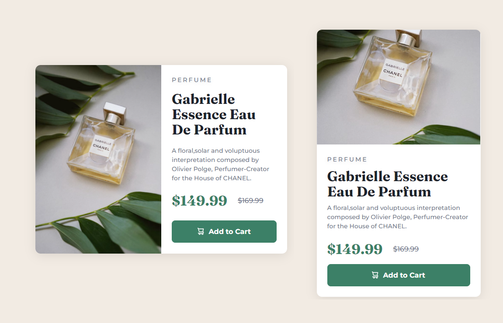

# Frontend Mentor - Product preview card component

This is a solution to the [QR code component challenge on Frontend Mentor](https://www.frontendmentor.io/challenges/product-preview-card-component-GO7UmttRfa). Frontend Mentor challenges help you improve your coding skills by building realistic projects. 

## Table of contents

- [Overview](#overview)
  - [Screenshot](#screenshot)
  - [Layout](#Layout)
  - [Links](#links)
- [My process](#my-process)
  - [Built with](#built-with)
  - [What I learned](#what-i-learned)
  - [Continued development](#continued-development)
  - [Useful resources](#useful-resources)
- [Author](#author)
- [Acknowledgments](#acknowledgments)


## Overview

## Layout

The designs were created to the following widths:

- Mobile: 375px
- Desktop: 1440px

### Screenshot


### Links
- Live Site URL: [https://silver-tartufo-22191b.netlify.app/](https://silver-tartufo-22191b.netlify.app/)

### Built with

- Semantic HTML5 markup
- CSS custom properties
- Flexbox

### What I learned
My major learning was the properties of Flexbox. Below, a snippet of CSS code where I used this property.
 
```css
body {
    font-family: 'Outfit', sans-serif;
    background-color: var(--light-gray);
    display: flex;
    flex-direction: column;
    align-items: center;
    justify-content: center;
    min-height: 100vh;
}
```

### Continued development
I would like to develop myself further in using properties like Flexbox and Grid, as well as improving my logic skills.

### Useful resources
- [A Complete Guide to Flexbox](https://css-tricks.com/snippets/css/a-guide-to-flexbox/) - This guide helped me understand better the Flexbox properties.

## Author
- Frontend Mentor - [@rvivenzio](https://www.frontendmentor.io/profile/rvivenzio)